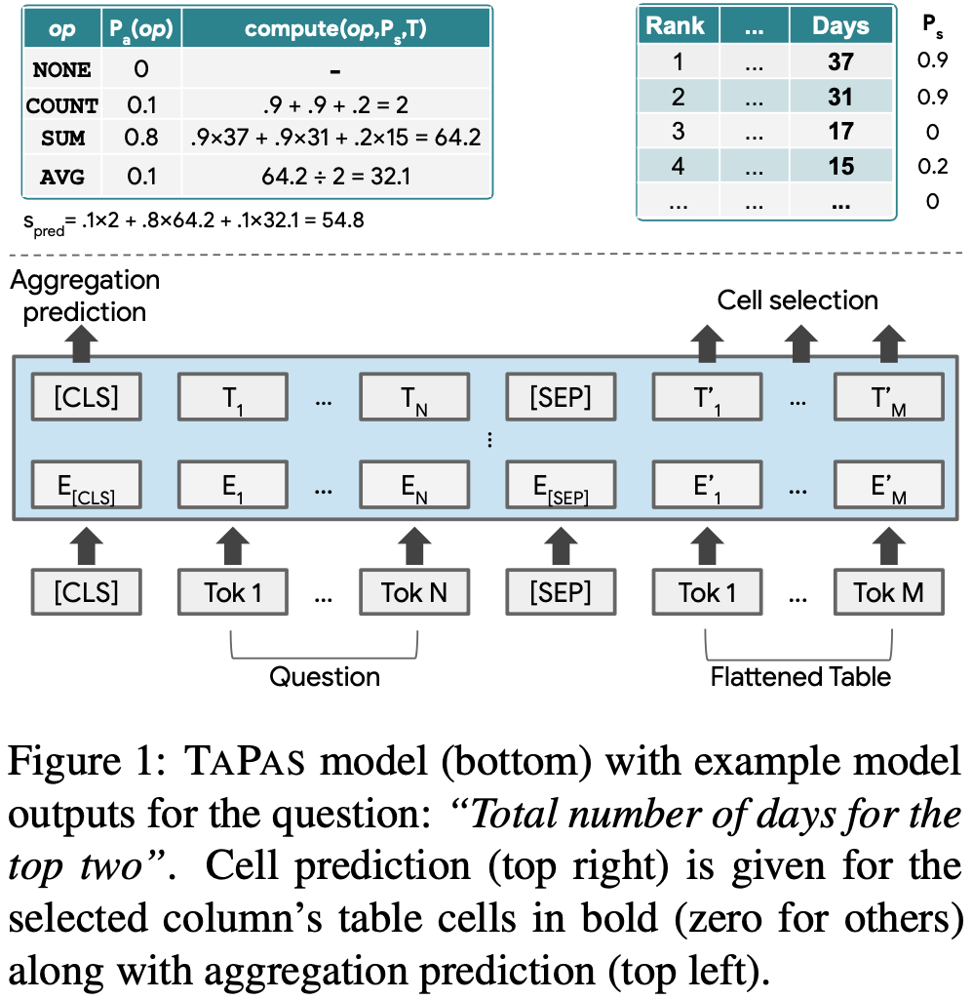
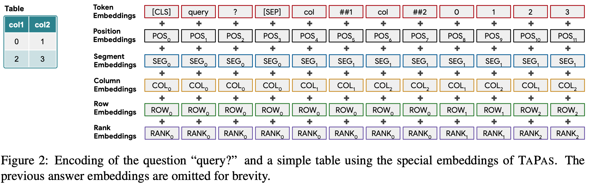
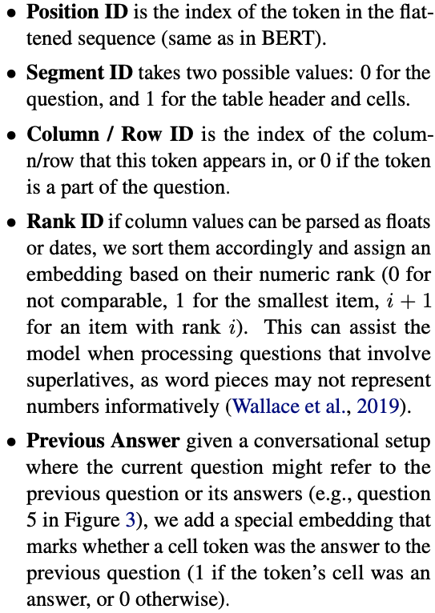
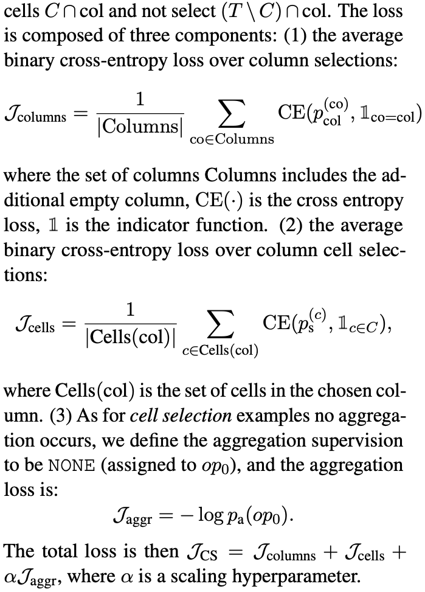
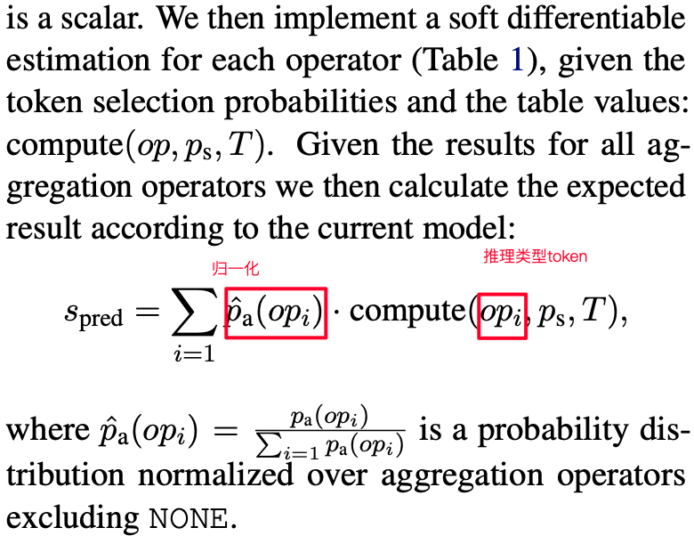
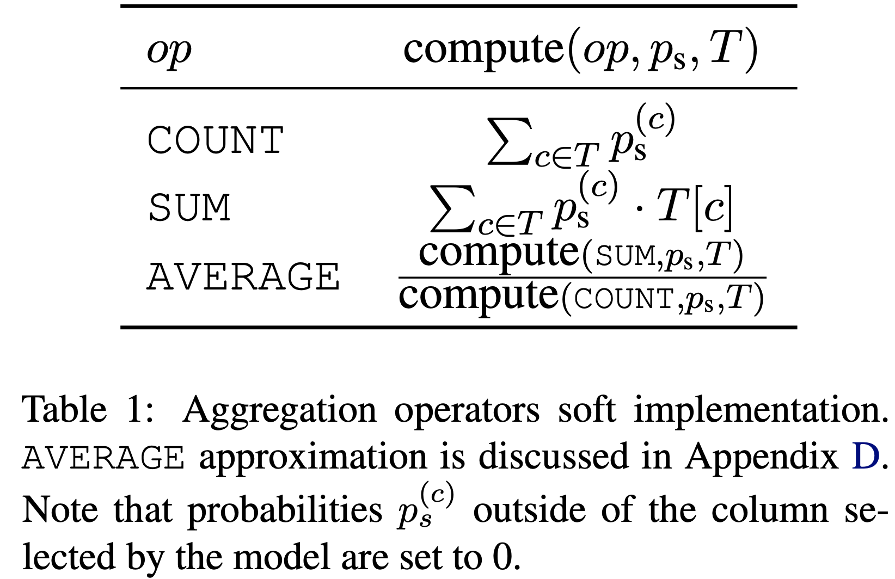
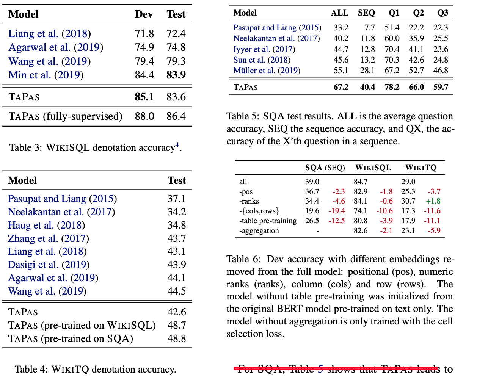

## 2020-arXiv: TAPAS: Weakly Supervised Table Parsing via Pre-training

摘要：一般基于表格的问答系统，通过利用表达结构关系生产逻辑关系（如使用弱监督方法生产知识图谱），然后基于逻辑关系来做问答。文本提出一种不生产逻辑关系的问答系统，文章的主要贡献是：1）在BERT架构上进行扩展，以query和tabel编码成token作为BERT的输入（与常见双塔pq架构不同）； 2）包括pre-training和fine-tuning两阶段：pre-training阶段是从Wikipedia上抽小表格（token数500以内），基于masking任务做成目标函数； fine-tuning阶段是基于query-table_answer进行训练，目标函数cell selection 和 Aggregation  prediction（AVG、SUM、COUNT）的分类问题。

模型介绍：

以query所有词和整个table词拉平做成n个token作为输入

每个token的组成如下：

**pre-training**： 获取Wikipedia上的table数据，使用masking方式来构建目标函数做预训练

**fine-tuning**：Cell selection 和 Aggregation operator prediction 都当做分类问题来做

**Cell selection**：

**Aggregation  prediction** ：

实验：

实验结果未分析