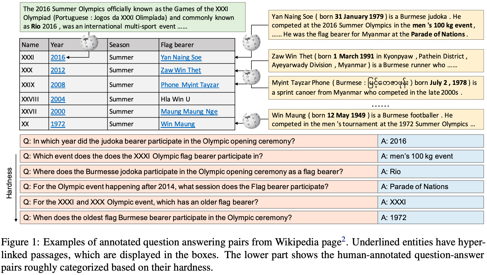
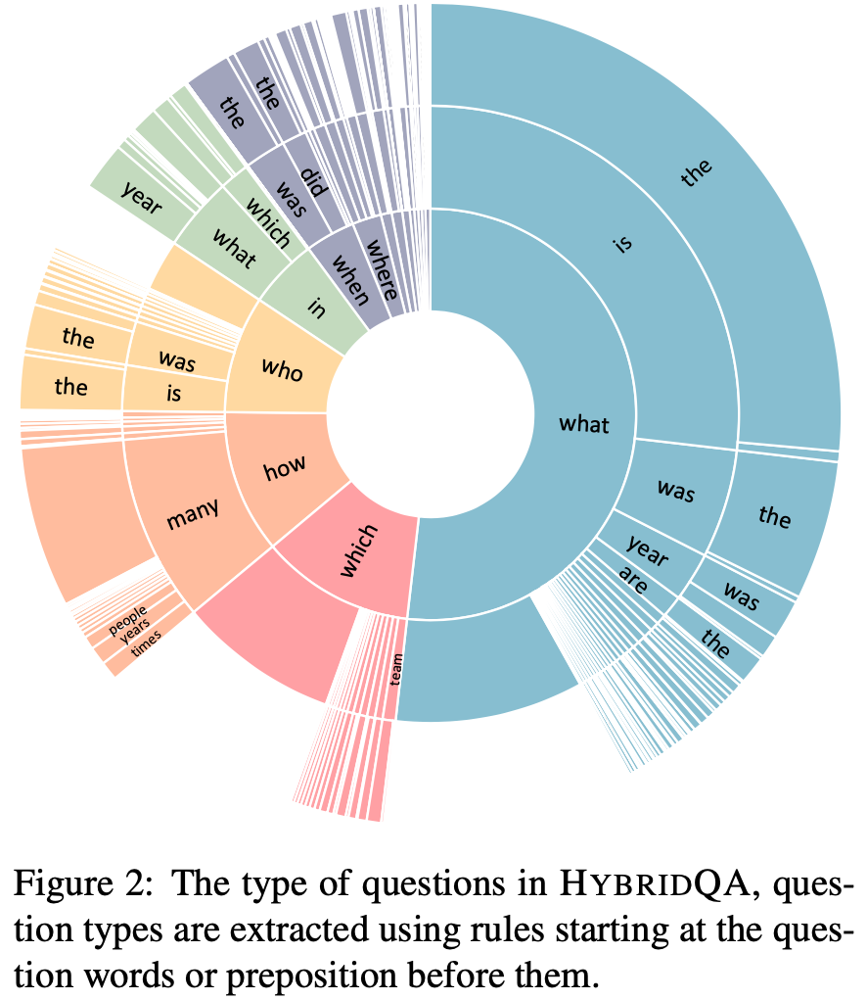
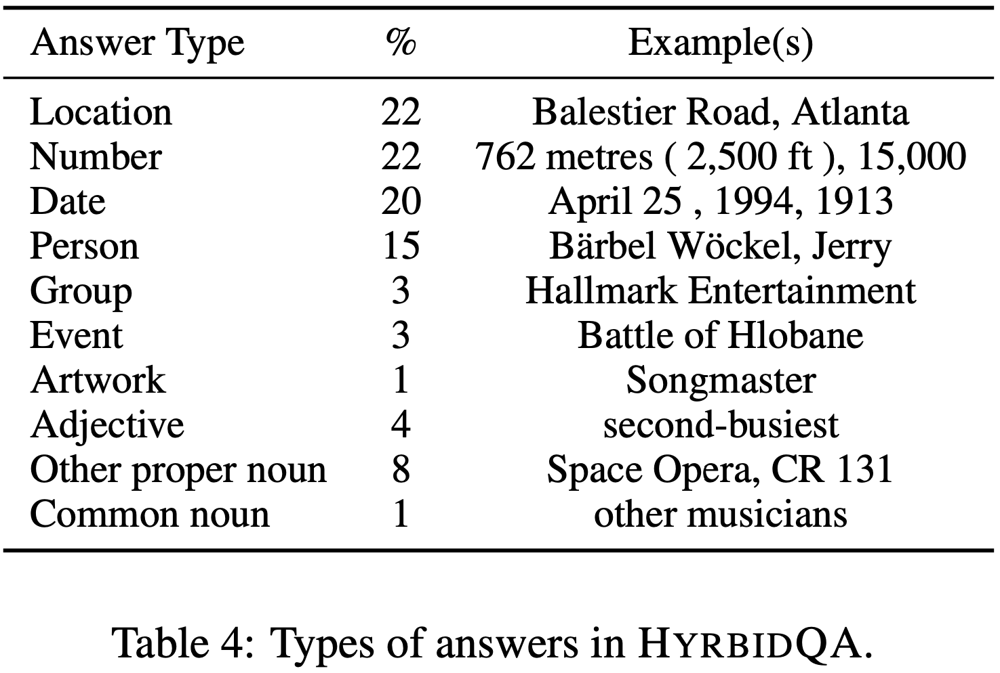
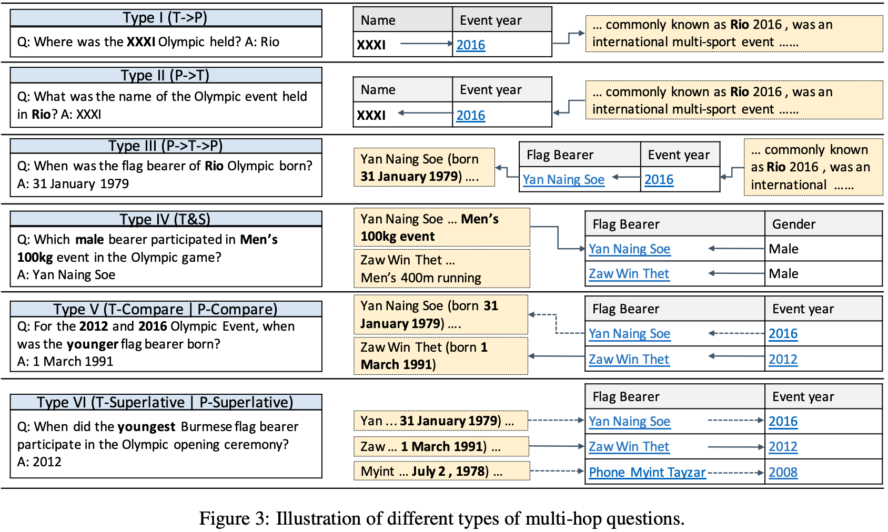
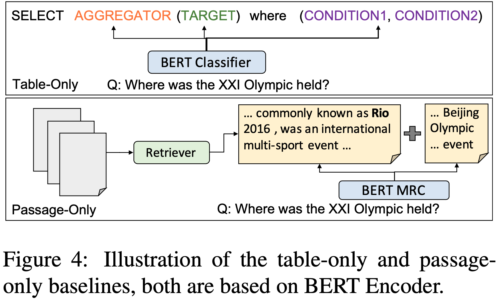
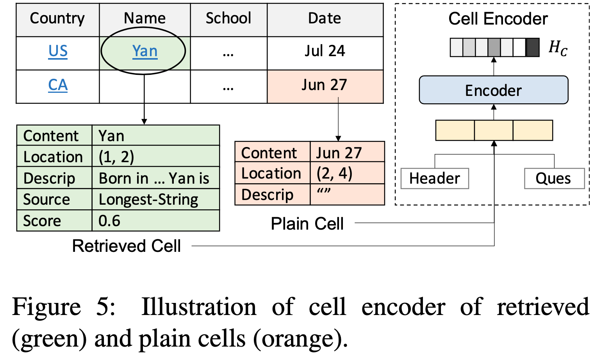
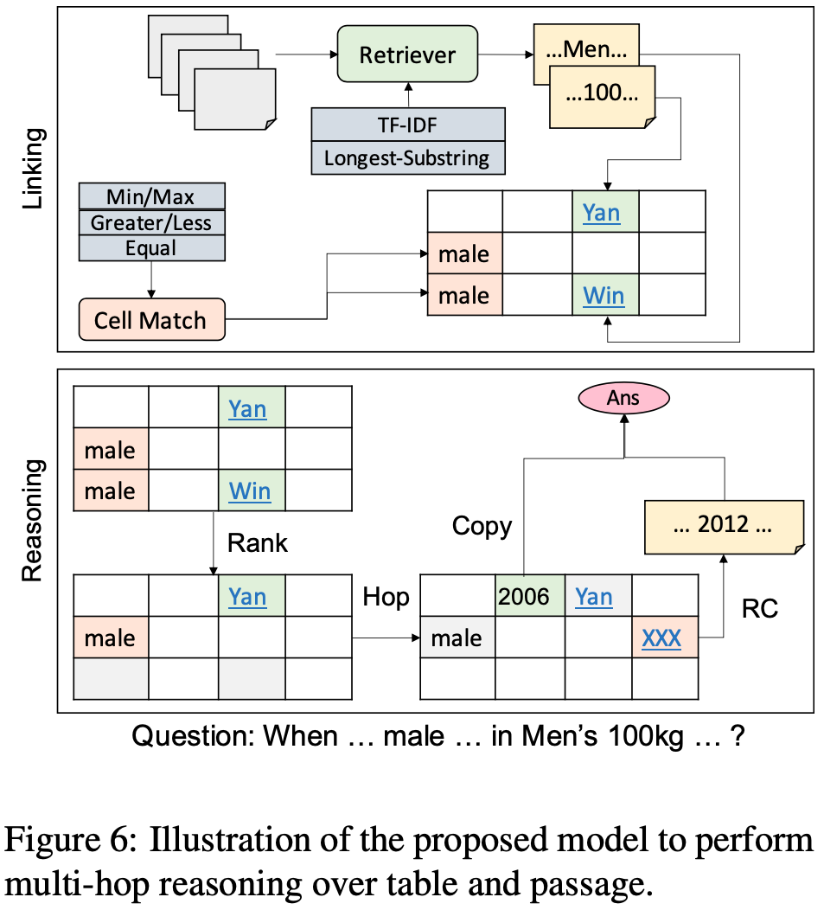
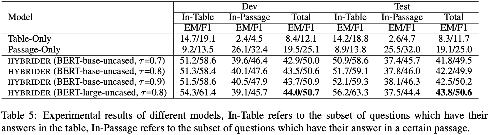

## 2020-EMNLP：HybridQA: A Dataset of Multi-Hop Question Answering over Tabular and Textual Data

摘要：现有的QA数据集聚焦于同构数据，比如：纯文本，纯表格数据。然而现实知识库通常是异构数据，比如文本和表格的结合。因此构建一个大规模异构数据集，同时提出一种HybridQA方法。并且测试table-only model、text-only model、Hybrid model三种方式的效果。结果表明HybridQA明显优于另外两个。

**问题描述**：给定一个表格，表格中实体会有一段文本描述。对于一个query，从表格和文本描述数据库中找到答案。找答案的过程分为两步：第一步是link到相关答案的cell或passage，第二步是通过阅读理解从相关cell或passage中定位到答案。

### 数据集：

问题类型：

答案类型：

推理类型：

### 模型

table-only model： 将问题encode成向量，再解释（翻译）成SQL执行查询语句

text-only model检索过程：检索相关doc，然后阅读理解定位答案

Hybrid model：

Linking：链接部分是将表格中每个单元格和passage 通过  Cell Matching 和 Passage Retriever 进行链接，链接方式包括指向型，大于小于等于等，linking后得到每一个单元格是一个五元组（content，location，description、source，score）

Reasoning：推理部分包括三个步骤，第一个步是单元格预测（相关性检索），得到相关的答案；第二步是单元格跳转，把可能相关的单元格检索出来，第三步是阅读理解，如果单元格没有link则直接输出单元格内容作为答案，否则进行阅读理解定位答案的起止位置。

### 实验

git：https://github.com/wenhuchen/HybridQA

