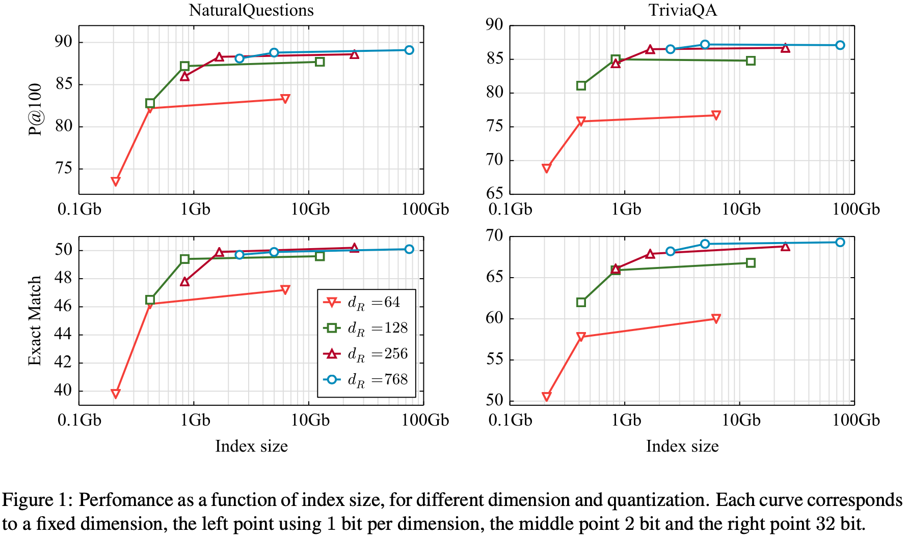

## 2020-arXiv: A Memory Efficient Baseline for Open Domain Question Answering

摘要：文章提出了三种策略 dimension reduction、vector quantization、passage filtering解决dense retriever- reader systems需要大量内存的问题。1、数据降维是增加了一个线性层映射网络输出到一个$d_{R}-$dimensional vector；2、矢量量化是对输出的向量用乘积量化的方法建索引；3、数据过滤是训练了一个线性分类器过滤掉一些非答案的网页。

模型：无介绍

实验：

每条线是固定向量维度的结果，线上的三个点分别是 8维用1bit，2bit，32bit进行PQ量化。实验表明数据降维一定程度上仍然能保持较少的精度损失（128维以上），每条曲线随着PQ量化bit位增加精度提升（1->2bit变化明显）

红线是$d_{R}=256$， 蓝线是$d_{R}=128$，横坐标是过滤后数据量从 10M->26M，纵坐标是EM值。

内存由81G->5.1G，精度损失在$1\sim 2 \%$
