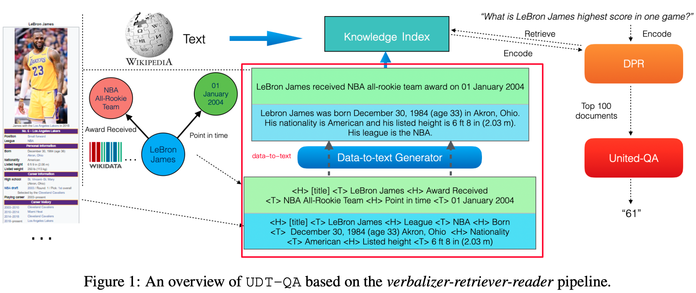

## 2021-Open Domain Question Answering over Virtual Documents: A Unified Approach for Data and Text

摘要：data（结构化数据）和text是普遍存在，data-to-text是非常受欢迎的。一小部分方法聚焦于在data上运用推理的方式来用于下游任务（QA）。本文主要提出了一种data-to-text的生成器来建立data和text的桥梁，并基于此做成了一个*verbalizer-retriever-reader* 框架。其中核心部分是 data-to-text生成器，该部分有两个创新点：1）输入数据组织上由triple改为pairs；2）输入训练集到DART模型之前上加入一些数据过滤策略

1、data-to-text描述：

比如给定一个data（勒布朗詹姆斯的小表）：结合表名、列明、单元格值等信息，生成一段text来描述表中信息（尽可能准确且完整） 

2、数据输入形式由triple改为pairs
考虑triple:三元组之间对一个实体而言信息是割裂开的， 难以在三元组信息上做推理（比如：詹姆斯的在骑士和湖人的效忠时间那个长）

同样以勒布朗詹姆斯表为例： 

triple： [表， title，勒布朗詹姆斯]， [勒布朗詹姆斯，league， NBA]， 表的title是勒布朗詹姆斯， 勒布朗詹姆斯的league是NBA，三元组作为模型的输入

pairs： [title, 勒布朗詹姆斯]，[league， NBA]，title是勒布朗詹姆斯，league是NBA 组成pairs作为模型的输入

3、过滤规则

考虑到data-to-text中对data数据的覆盖和准确（简短精准），记subsample training data模型记为 T，在T的基础上提出一个基于Rouge-1[https://aclanthology.org/W04-1013.pdf]的打分方式过来掉低于阈值的训练数据 记为 T-F（过滤掉训练集中，摘要生成Rouge-1低分的数据）。但是T-F过后还是会存在单元格中单词过长的问题，提出一种迭代T-F的方式：即将上一轮T-F产出的数据继续通过Rouge-1打分进行过滤，多次迭代后的模型记为ID-T

做完以上数据处理后，following T5-large[https://aclanthology.org/2021.naacl-main.37.pdf]模型进行data-to-text。

data-to-text模型需要继续看：DART: Open-Domain Structured Data Record to Text Generation （https://aclanthology.org/2021.naacl-main.37.pdf）

