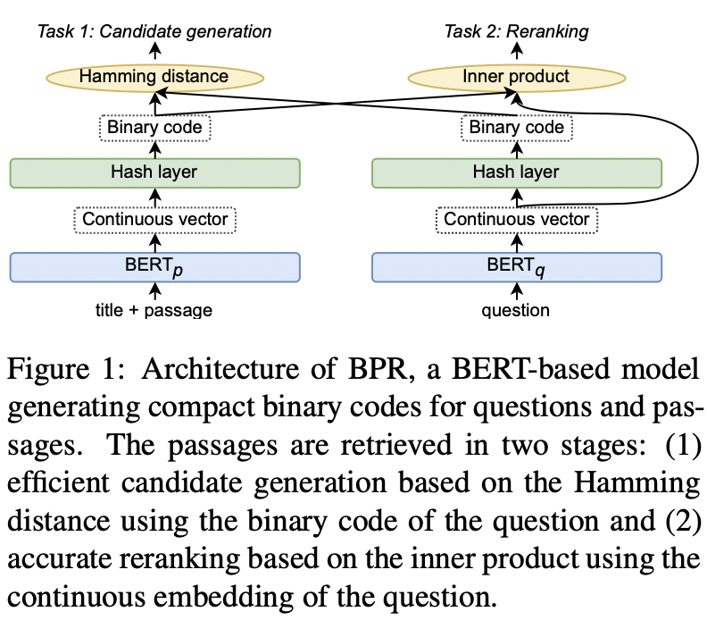
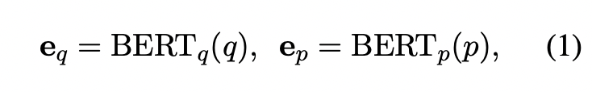
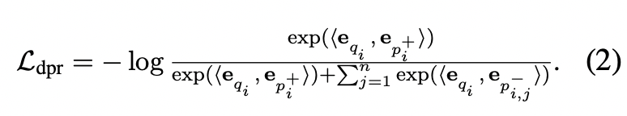
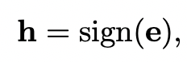
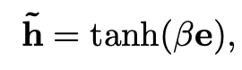
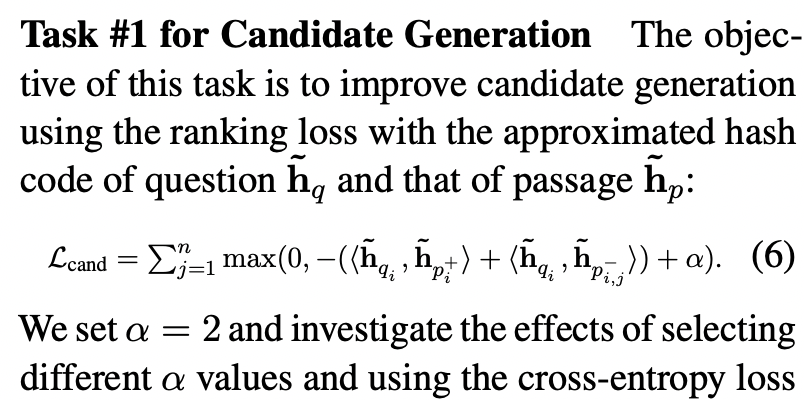
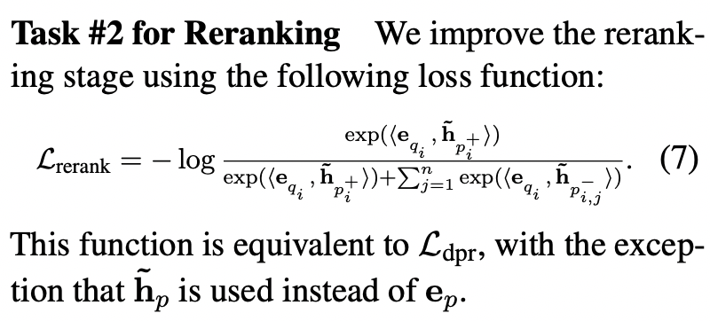
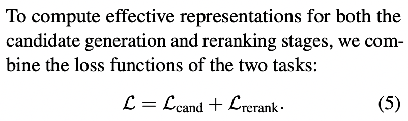
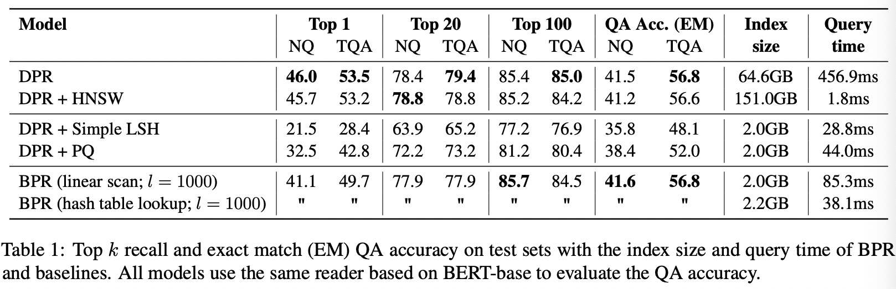

## 2021-ACL：Efficient Passage Retrieval with Hashing for Open-domain Question Answering

**摘要**：文章提出一个*Binary Passage Retriever* (*BPR*)方法，解决问答检索中需要大量索引内存问题。首先，基于BERT对query和passage进行实向量表示；然后，在BERT层后接入hash层学习query和passage的二进制码表示，hash层采用符号函数的近似函数tanh；最后，目标函数采用候选生成损失函数和重排序损失函数的加和作为最终的损失函数。

#### **模型**

**1、Dense Passage Retriever（DPR）**

**2、Binary Passage Retriever（BPR）**

**（符号函数的近似)**

**任务1损失函数**

**任务2损失函数**

**目标函数**

#### **实验**

问题：

Candidate Generation 损失函数$\max(0, -(<h_{q}, h_{p+}> + <h_{q}, h_{p-}>) + \alpha) $中间加号应该是减号才对

思考：

1）hash层只采用了简单的tanh，可以考虑参数学习的方式学习hash函数

2）候选生成损失函数和重排序损失函数没有采用加权方式

相关文献：

1、Reading Wikipedia to Answer Open-Domain Questions 陈丹琦 开放领域下问答，通过wikipedia找到相关的内容来生成answer

2、Dense Passage Retrieval for Open-Domain Question Answering 论文强依赖参考文献

3、A Memory Efficient Baseline for Open Domain Question Answering 论文类似工作参考文献

git：https://github.com/studio-ousia/bpr