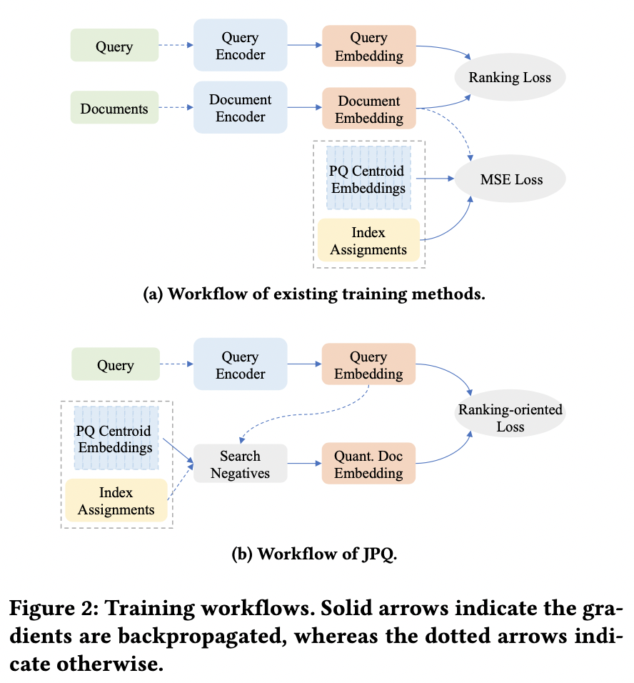
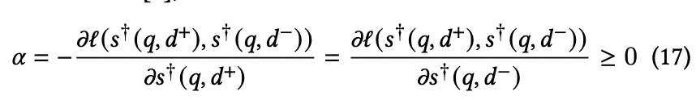
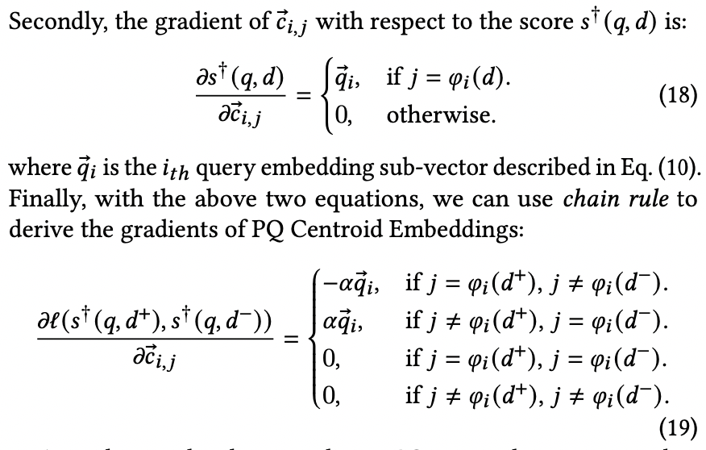
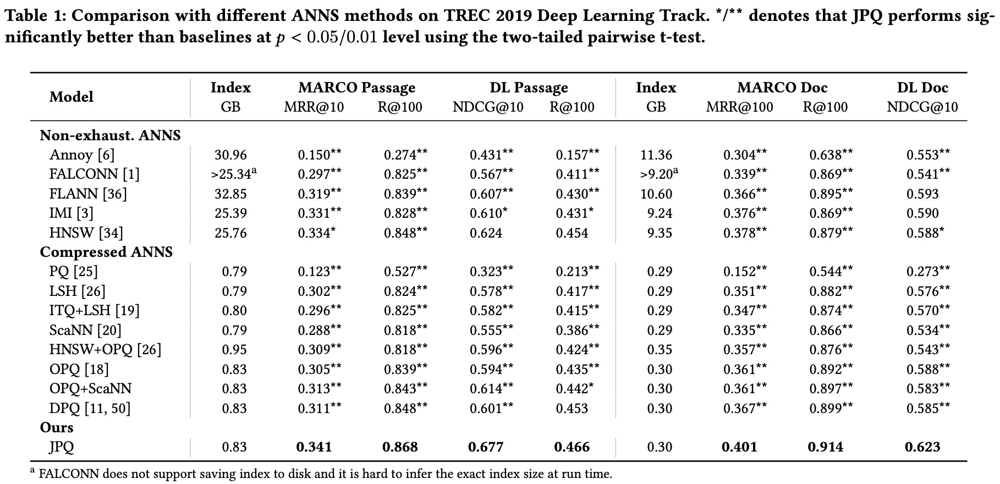

### 2021-CIKM：Jointly Optimizing Query Encoder and Product Quantization to Improve Retrieval Performance

摘要：文章提出一种联合Query Encoder和Product Quantization的方法，用于解决传统的先对query和document的Encoder，然后对document建索引存在两阶段损失的问题。方法核心：1）在学习query Encoder和 document Product Quantization（PQ）时，将pair-wise ranking损失转化为 JPQ pair-wise ranking 损失，2）优化query向量可以采用传统的梯度下降方法，对于PQ的质心点的优化，提出了PQ Centroid Optimization，3）采用负采样的方式增加负样本。

##### **Model**

 
**1）Product Quantization (乘积量化)**

将$S\subset R^{D}$的$D$维向量按笛卡尔积划分为$M$个子空间，每个子空间维度为$\frac{D}{M}$，然后在每个子空间做量化(K类聚类)，得到如下类中心：
$$
c_{i,j} \in R^{\frac{D}{M}},{(1 \le i \le M, 1 \le j \le K)}
$$
将每一个点$d \in R^{D}$量化到类中心$\hat{\vec{d}}$，即如下：
$$
\vec{d} \rightarrow \hat{\vec{d}} = \vec{c_{1,\phi_{1}({d})}}, \vec{c_{2,\phi_{2}({d})}},.., \vec{c_{M,\phi_{M}({d})}} \in R^{D}
$$
将query和doc的相似性转为query和doc类中心相似性：
$$
s(q,\vec{d})\rightarrow \hat{s}(q,\vec{d}) = <q,\hat{d}>
$$
将wise ranking损失转化为 JPQ pair-wise ranking 损失：
$$
L(\hat{s}(q,\vec{d^{+}}), \hat{s}(q,\vec{d^{-}}))
$$

**2)PQ Centroid Optimization (量化质心点优化)**

##### **Experiments**

问题：“2.4.5中Time Complexity. The overall time complexity is 𝑂 (𝑁 𝑀 + 𝑁 log𝑛). ”  应该是$KMD，N=(K)^M$

相关文献：

1、A Survey on Learning to Hash 哈希学习综述文献

2、Product quantization for nearest neighbor search 乘积量化原始文献

3、Differentiable Product Quantization for End-to-End Embedding Compression 较新的一篇乘积量化文献

git：https://github.com/jingtaozhan/JPQ
