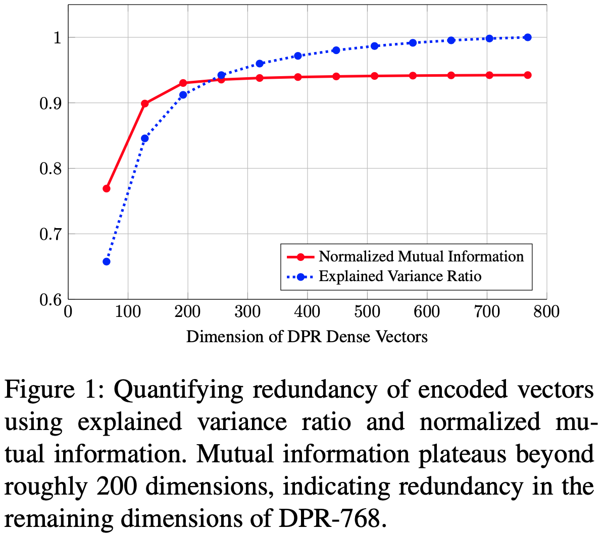
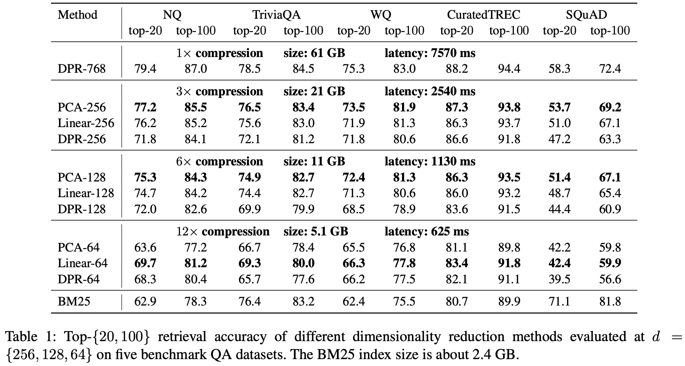
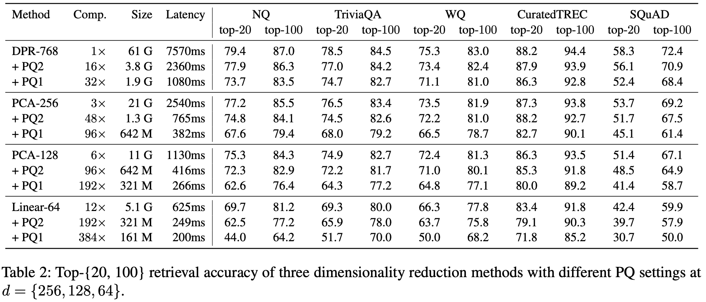

## 2021-EMNLP: Simple and Effective Unsupervised Redundancy Elimination to Compress Dense Vectors for Passage Retrieval

摘要：为了节省Dense Passage Retrieval内存的使用，提出了降维、乘积量化，混合检索三种策略。1）降维包括有监督版：在fine-tune阶段最后一层接入线性层（其他层参数不变），同时在QA的目标函数中引入正则项$|W_{q} W_{p}^{T} - I |_{2}$，其中$W_{q}$和$W_{p}$分别是query侧和passage侧参数，无监督版：是对预训练query和passage进行PCA降维，使用PCA参数对预测时query和passage进行降维后计算相似分；2）使用乘积量化对dense vector进行压缩；3）混合检索是指 $score_{dense} + \alpha \cdot score_{spare}$ 。

模型：无介绍

实验：

1、对DPR-768的进行主成分分析，使用互信息和方差变化率来衡量不同维度下信息量变化，发现维度在200左右信息量增益曲线减缓，说明768位向量90%的主成分可以用200维向量进行压缩表示。

2、相比于DPR-768基线，PCA降维和监督线性降维会带来精度的损失。相同维度下对比 PCA-d、linear-d、DPR-d，在256，128维上PCA效果最好，在64维上linear效果最好。

3、相比于DPR-768基线，PQ2($768*32bit \rightarrow  192* 8bit$)实现16倍压缩，耗时加速3倍，精度损失在$2\sim3\%$之间。

混合检索策略不是非常明显，暂不分析。

git：https://github.com/castorini/pyserini/
