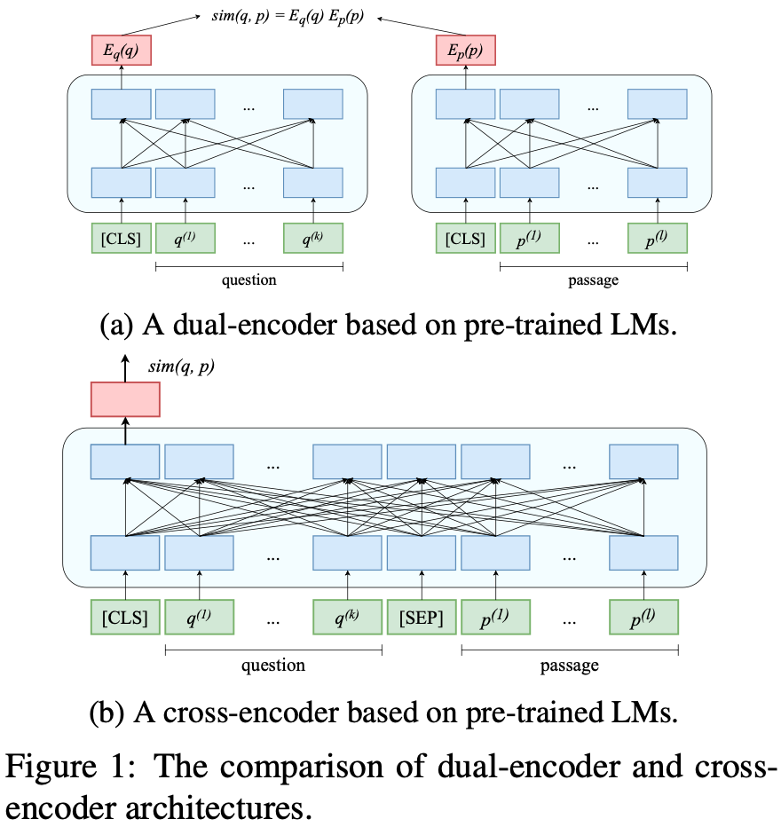
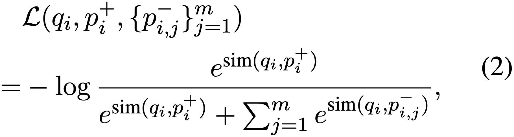
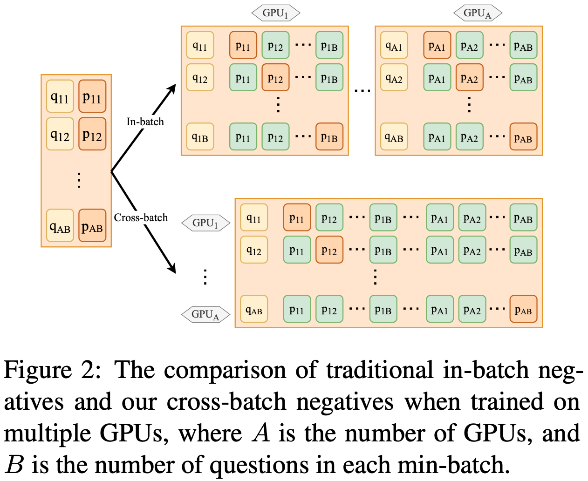
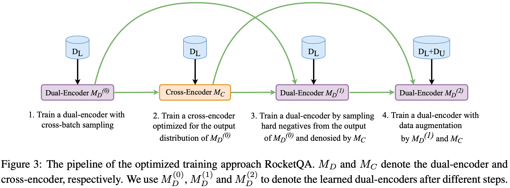
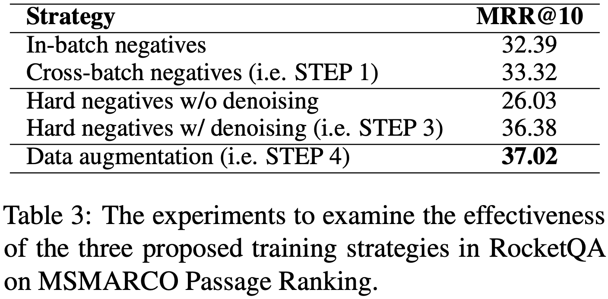

## 2021-NAACL RocketQA: An Optimized Training Approach to Dense Passage Retrieval for Open-Domain Question Answering

摘要：文章对dual-encoder网络结构的QA提出了三种优化策略：1、将In-batch negatives优化为 Cross-batch negative（不是所有的batch都可见，而是并行计算中GPU之间的batch可见），即在GPU并行计算时，GPU之间的数据是可见的，作为负样本进行采样；2、考虑到负采样中存在假负样本的问题（如果采样绝对负样本又没有价值，有效负样本又极容易引入脏数据），提出用Cross-encoder网络来剔除其中的假负样本；3、使用Cross-encoder来做数据增强，对无标签数据进行预测打标签，作为训练数据来用。

模型：

QA中两种常见的网络结构：双塔、q-p组合

Dual-encoder网络结构的目标函数：

1、Cross-batch negative：传统的in-batch只是batch内进行负采样，Cross-batch是并行的GPU之间数据共享

2、Denoised Hard Negatives：第二步中使用一个训练好的Cross-encoder来剔除假负样本

3、Data Augmentation：第四步中增加使用Cross-encoder来对无标签数据预测标签，作为补充数据

实验：

不同策略组合下的效果，结果来看是去负样本效果提升最大，其次 cross-batch、数据增强

git：https://github.com/ PaddlePaddle/Research/tree/master/NLP/ NAACL2021- RocketQA