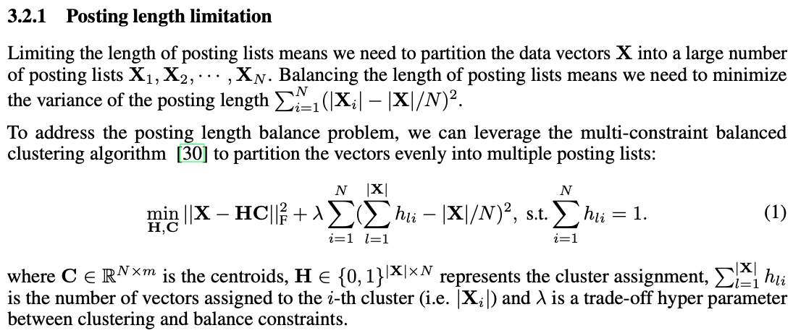
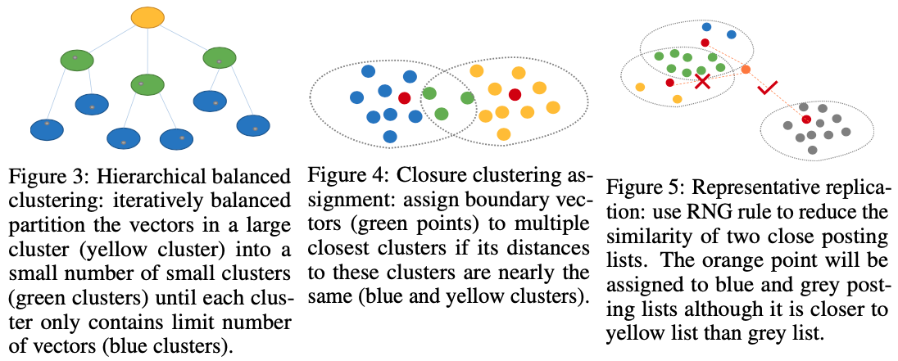
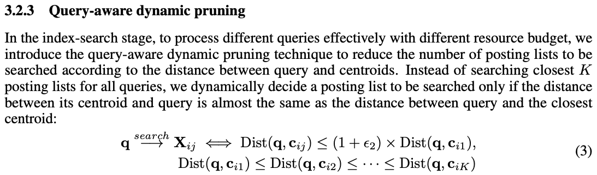
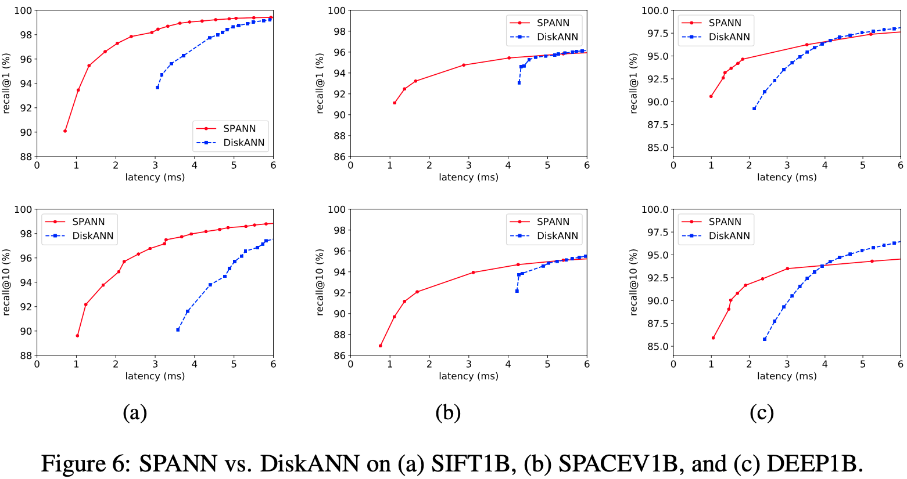
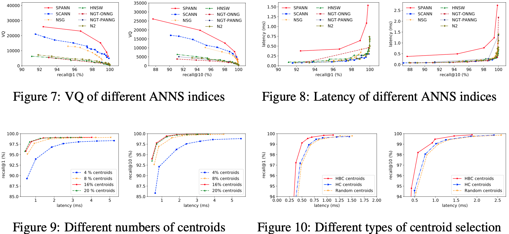

## 2021-NIPS SPANN: Highly-efficient Billion-scale Approximate Nearest Neighbor Search

摘要：解决大规模数据检索下需要高额成本（内存）的问题。提出一种memory-disk混合索引的ANN方法。为了获得低延迟、高召回的效果，减少访问disk的次数。首先建索引阶段：使用层级平衡聚类算法，将数据均衡分散到不同节点上，保证检索耗时平稳，同时在处理边界点上提出copy多份的方式保证召回。在查询阶段：比较节点上的中心点的距离只查询TopK个节点，同时提出一种query-aware来减少不必要查询的节点（当query与节点类中心大于一个阈值）。

模型介绍：

​	层次平衡聚类数据： 使得相近的点尽可能分布到一个节点上，这样查询时就不用遍历全部节点，而是遍历相近的几个节点，然后在节点内再找相近的点。其中保证每个节点上数据量平衡很关键，因为数据量不一样的话，每个节点耗时差别较大，系统长尾问题严重。

1、平衡聚类：

2、边界处理问题：

3、query-aware：

贡献：大规模数据分 memory-disk两级索引， 使用一个层级平衡聚类作一级索引，将数据分散到N个节点上，一级索引减少 查询节点数， 节点内数据同样可以使用ANN检索

实验：

git：https://github.com/microsoft/SPTAG.