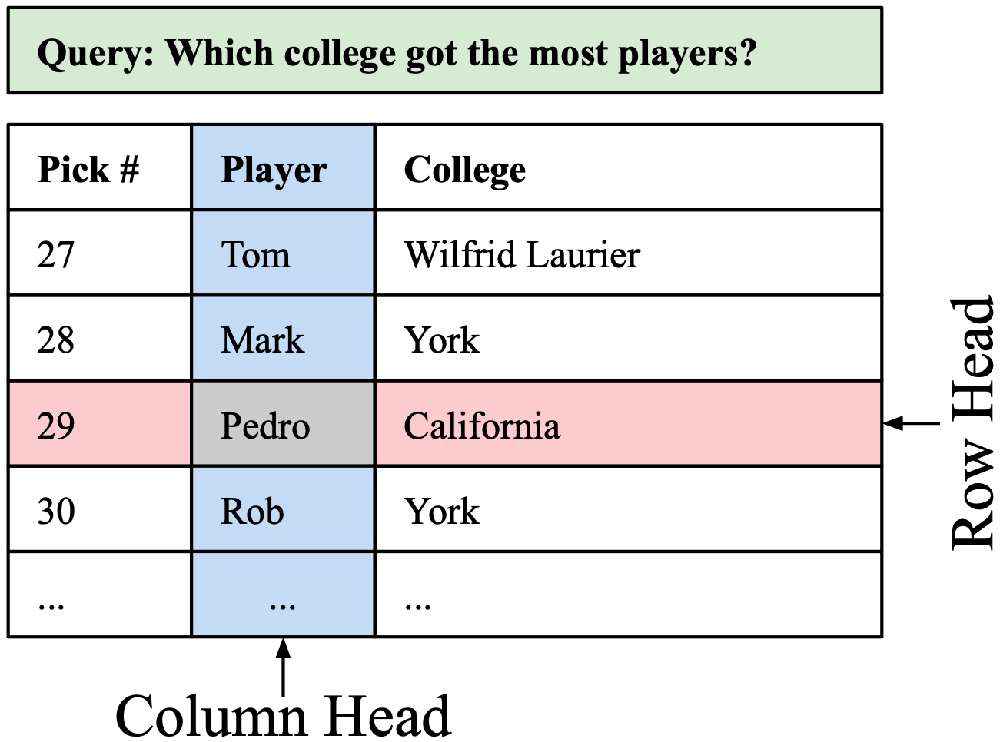
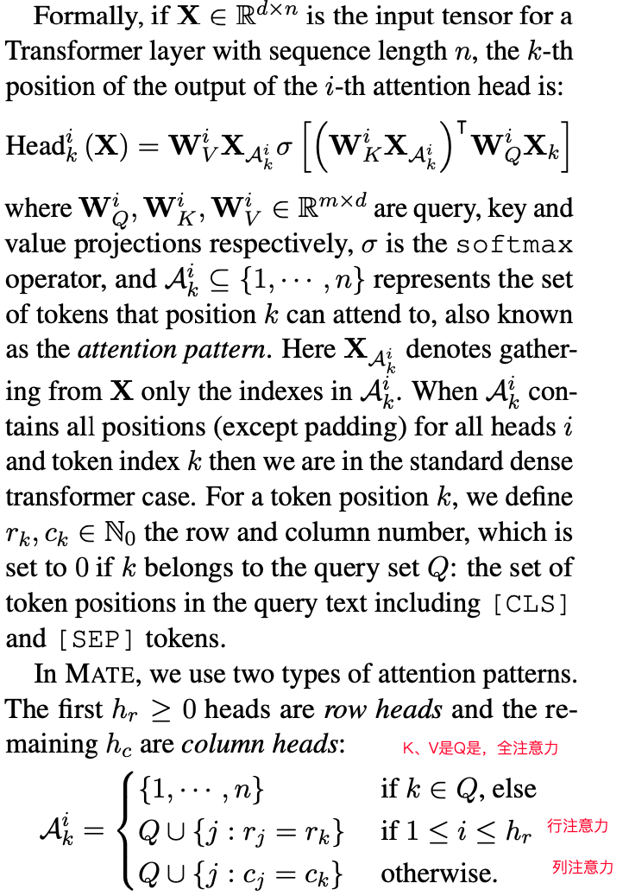
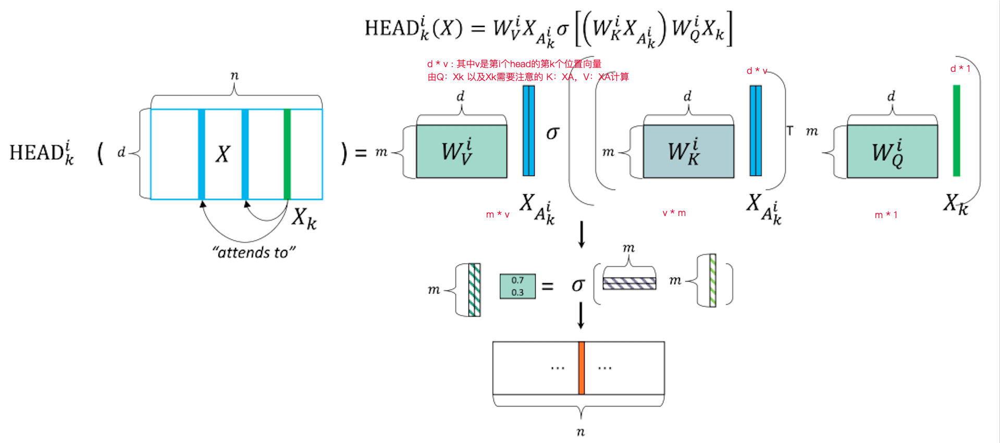
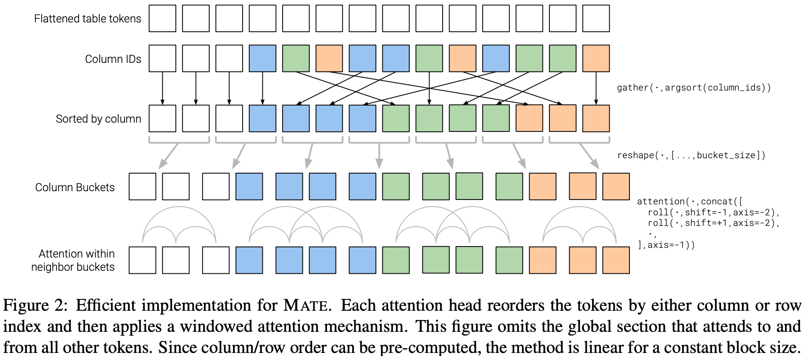
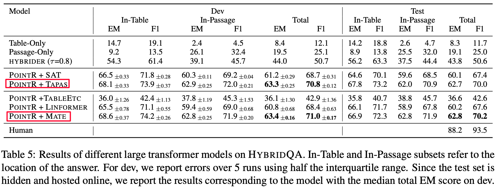

## 2021-arXiv: MATE: Multi-view Attention for Table Transformer Efficiency

摘要：文章是在TAPAS基础上解决使用Transformer中Token过长时带来的性能问题。1、考虑到table中有行列的特点，提出行注意力和列注意力的稀疏注意力机制，然而直接将稠密注意力机制转换为稀疏注意力机制只能提高注意力机制效果（精度），不能改善性能（内存），2、提出了一种近似的方式实现稀疏注意力机制：通过行列排序后将token分散到固定长度的桶内，只在桶内做Transformer，当只有一个桶的时候等价于作者提出的稀疏注意力机制。

模型介绍：

table中具有明显行列区别，因此作者提出了行注意力头、列注意力头的概念，具体体现的模型中如下：

然而直接稀疏注意力的话，参数$W_{Q},W_{K},W_{V}$仍然是Token的长度，因此提出一种近似的方法。首先将Token分为全局Token（稠密注意力、长度不长），局部Token（稀疏注意力、长度很长）。将Token拉平后进行行列排序，排序目标是尽可能保证半径R内的token是需要注意的局部Token，这样按每个桶放2R个Token就能保证半径R内的Token能注意到。$W_{Q},W_{K},W_{V}$的长度就不受Token长度限制，而是有半径R决定。

最后给出 POINTR architecture，包括 POINTR: Cell Selection Stage， POINTR: Passage Reading Stage两个阶段，同TAPAS一致，不再介绍。

实验：

git：https://github.com/google-research/tapas

